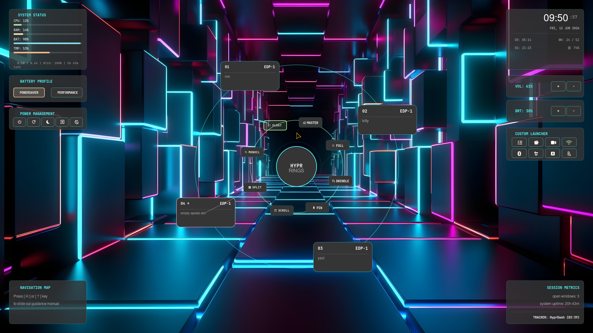

# HyprRings

A minimalist, hardware-accelerated workspace dashboard and system telemetry overlay engineered specifically for the Hyprland compositor. Utilising GTK3, GtkLayerShell, and pure Cairo vector rendering. HyprRings provides a lightweight, low-overhead interactive ring layout to manage workspace layouts, execute system tasks, and monitor hardware metrics directly from the desktop layer.



### Features
- Interactive circular ring layout mapping active workspaces including specials, power profiles, and custom utilities.
- Real-time hardware telemetry tracking CPU utilization, memory usage, battery state, core temperatures, and wireless connectivity.
- Desktop environment control integration including display backlight manipulation via brightnessctl and audio stream management via wireplumber.
- Native compositor command routing utilizing direct dispatch commands, completely bypassing heavy evaluation pipelines.
- Fluid keyboard navigation support alongside interactive mouse-driven canvas tracking.

### Dependencies
**The runtime environment requires the following components to be installed on the system**:
```zsh

python3

gtk3

gtk-layer-shell

python-gobject (PyGObject)

python-cairo (Pycairo)

brightnessctl (for display control updates)

wireplumber (for wpctl audio adjustments)
```

### Architecture
**The application structure enforces a strict division between initialization execution and the active layout rendering framework**:

- **main.py**: Serving as the minimal boilerplate entry point, this script initializes the system layer configuration and starts the core GTK application loop.
- **interface.py**: Housing the WorkspaceDashboard container, this component handles vector drawing logic, manages Wayland pointer tracking anomalies, and orchestrates synchronous control commands.

### Installation and Execution
**Clone the project repository to the local system and execute the application entry script directly from the terminal layer**:

`git clone https://github.com/Rakosn1cek/HyprRings.git`

`cd HyprRings`

`python3 main.py`

### Configuration
Workspace rings and custom operational tools hook directly into the interface handlers. Standard workspace tracking maps automatically to the active viewport arrangement, while dedicated special workspaces like the standard scratchpad are toggled dynamically using native compositor API instructions.

> *NOTE: The Custom Launcher has hard-coded personal tools in it. If you want to use your own, you will need to change them in the interface.py. Also, special:minimize workspace is using standalone script hypr-minimize.py available from my dotfiles.* 

## Warning
This project is strictly personal and in active development. If you decide to use it and something is not working on your machine, you can open an Issue and I will try to help. 

### License
MIT License

Copyright (c) 2026 Lukas Grumlik (Rakosn1cek) 
